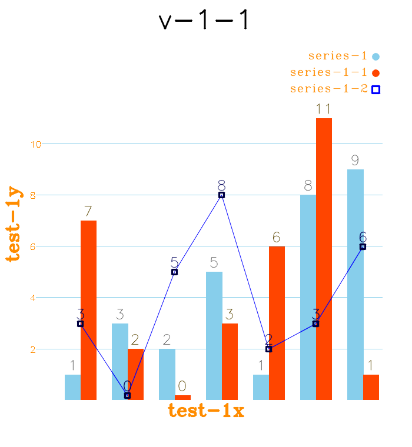

# cvplot
Yet another cvplot, draw charts (like bar, scatter, line, etc) with OpenCV.

Easy to use (one header file ONLY).


[TOC]

## Supported chart types ##

- Bar
- Trends
- Line
- Scatter
- Elevation


## Supported features ##

- Sub-plots
- Save as image (sub-plots also)
- Background color
- Render color
- Text color
- Set size
- Set title
- Set X,Y labels
- Legend on/off
- Different markers
- Axis grid
- **Dump & load with file**  (just like `serialization/ deserialization`)


## Usage ##

It is as easy as below:

```cpp
#include "cvplot.h"

int main()
{
	auto s = cvplot::Series("foo", cvplot::chart::Bar).AddValues({ 3,2,5,9,0 });
	auto v = cvplot::View().SetTitle("bar").SetSize({ 600, 600 }).AddSeries(s);
	auto f = cvplot::Figure().SetLayout(1,1).SetView(v, 1, 1);
	f.Show();
	f.Save("figure.png");
    return 0;
}
```


## Screenshots ##

One **figure** with layout '1-by-3' (sub-plots) is shown as below.


**Sub-plots** can also be saved as images, see below.




